# Job Board Portal Management System

Shoglana a Job Board Portal Management System built with Django, designed to facilitate job postings, applications, and user management. This system provides a platform for employers to post job and for job seekers to browse and apply for jobs.

## Table of Contents

- [Job Board Portal Management System](#job-board-portal-management-system)
  - [Table of Contents](#table-of-contents)
  - [Preview](#preview)
  - [Video Preview](#video-preview)
  - [Screenshots](#screenshots)
  - [Features](#features)
  - [Technology Stack](#technology-stack)
  - [Setup and Installation](#setup-and-installation)
    - [Installation without Docker](#installation-without-docker)
    - [Install using Docker (Optional)](#install-using-docker-optional)
  - [Future Development](#future-development)
  - [Contributing](#contributing)

## Preview

## Video Preview

[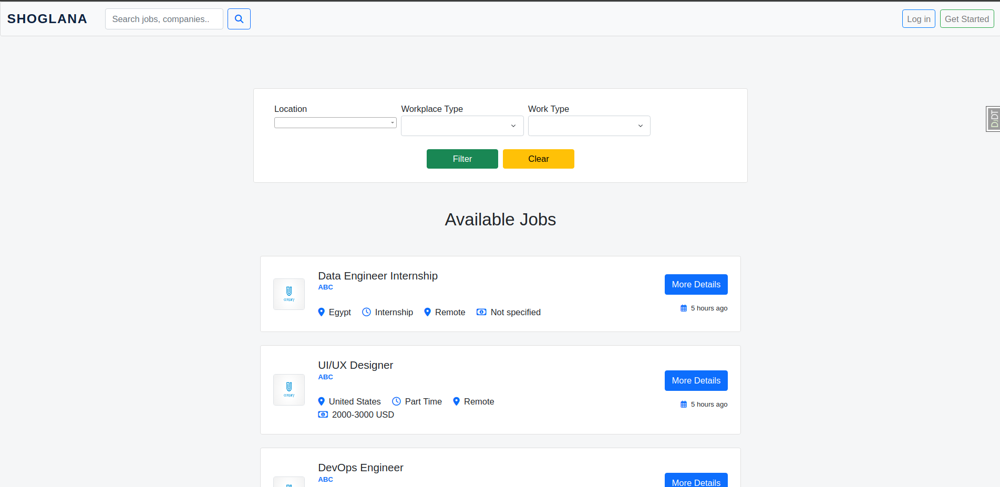](https://www.youtube.com/watch?v=lOiropOd8ks)

## Screenshots


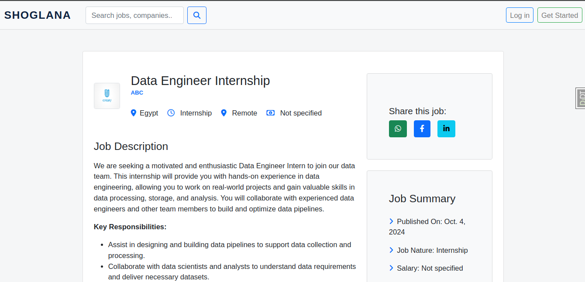
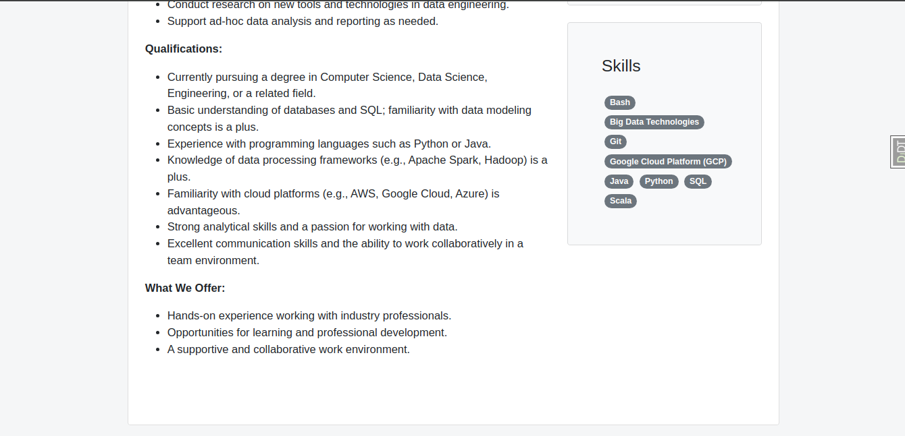
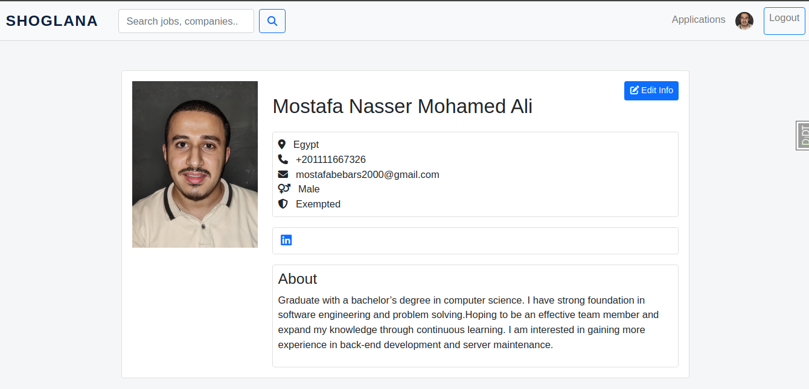
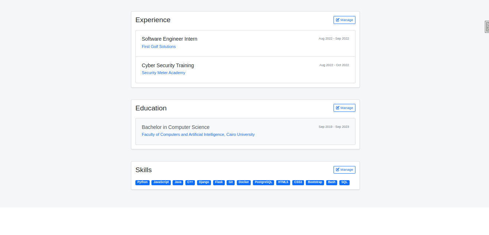
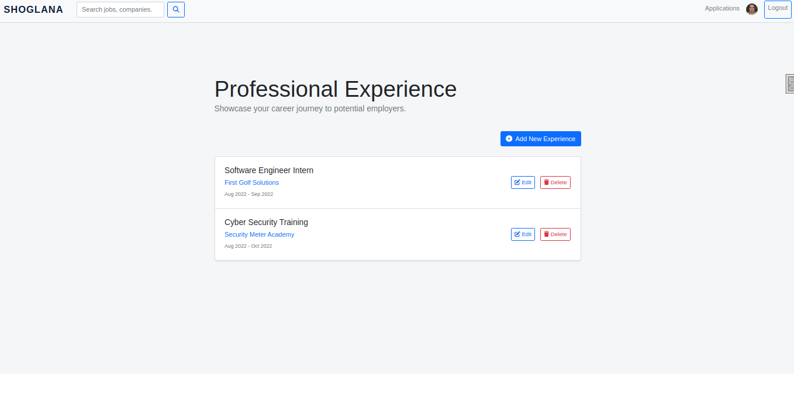
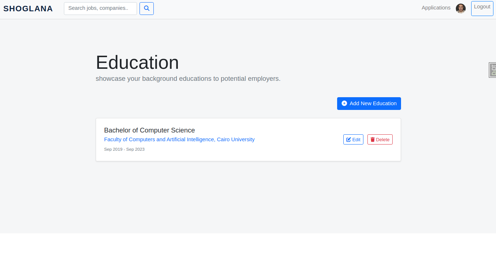
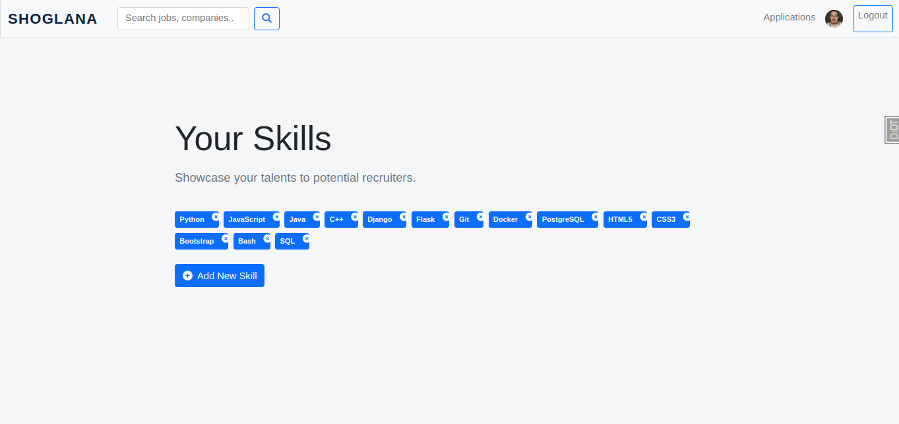
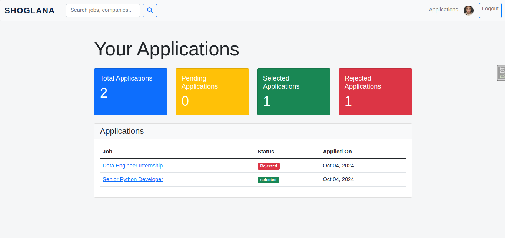
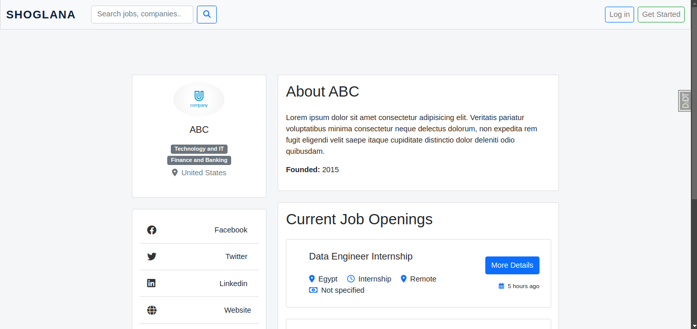


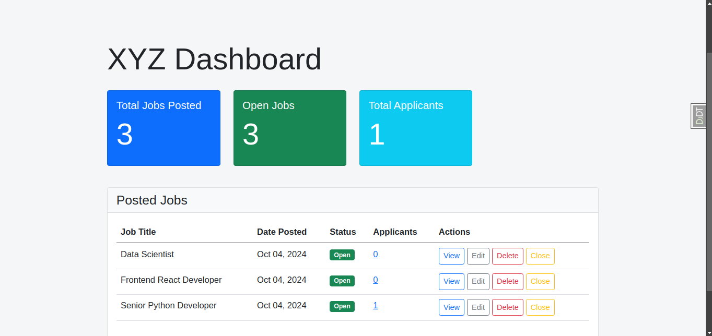


## Features

- User authentication and authorization.
- User and Company profile management.
- Job posting creation and management.
- Job application submission and tracking.
- Dashboard for tracking jobs by companies.
- Dashboard for companies for tracking applications for a job.
- Dashboard for users for tracking their applications.
- Search functionality for jobs.
- Responsive design for mobile and desktop viewing.

## Technology Stack

- Backend: Django
- Frontend: HTML, CSS, JavaScript, Bootstrap
- Database: SQLite (default), (Postgresql) for Docker version only
- Containerization: Docker

## Setup and Installation

### Installation without Docker

1. Clone the repository:

```
git clone https://github.com/your-username/job-board-portal.git
```

2. Navigate to project folder
3. Create a virtual environment and activate it:

```bash
python -m venv venv
source venv/bin/activate  # On Windows, use `venv\Scripts\activate`
```

3. Install the required packages:

```bash
pip install -r requirements.txt
```

4. Setup the database:

   replace this section at `jobs/settings.py`

```python
DATABASES = {
  "default": {
      "ENGINE": "django.db.backends.postgresql",
      "NAME": SECRETS.get("DB_NAME", "jobs_portal"),
      "USER": SECRETS.get("DB_USER", ""),
      "HOST": SECRETS.get("DB_HOST"),
      "PASSWORD": SECRETS.get("DB_PASSWORD", ""),
      "PORT": SECRETS.get("DB_PORT"),
    }
}
```

with the following

```python
DATABASES = {
    "default": {
      "ENGINE": "django.db.backends.sqlite3",
      "NAME": BASE_DIR / "db.sqlite3",
  }
}
```

5. Apply the migrations to the database:

```bash
python manage.py migrate
```

6. Run thin command to populate database with data for skills, industries, countries, and currencies:

```bash
python manage.py populate_data --industry industry.txt --country country.txt --skills skills.txt --currency currency.txt
```

7. Run the development server

```bash
python manage.py runserver
```

8. Access the website at `http://127.0.0.1:8000/`:

### Install using Docker (Optional)

1. Build the images:

```bash
docker compose build
```

2. Run the containers

```bash
docker compose up
```

3. Access the website at `http://0.0.0.0:8000`

## Future Development

- Improve the project overall performance.
- Develop a public API for integration with other services or platforms.
- Develop an AI-powered recommendation system for job seekers.
- Implement notifications system about new relevant job postings

## Contributing

Any one are welcome to contribute to project. Please don't hesitate if you want to add feature, fix a problem or suggest some improvement to the code base, to contribute follow the known contribution steps:

1. Fork the repository.
2. Create a new branch for your `feature`, `fix`, `enhancement`.
3. Make your changes.
4. Commit your changes and push to the branch on your fork.
5. Open a Pull Request.
